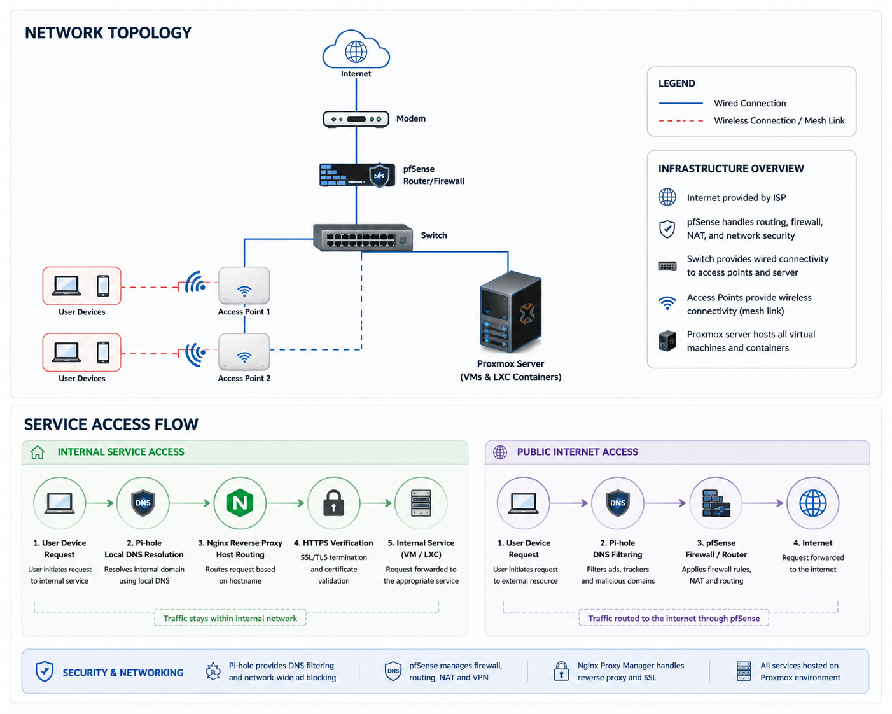

# My Homelab Setup
This repo contains details of my homelab including network diagrams, services, and features. This is a work in progress and I still have a lot to update and work on. 
## Stack
- Proxmox VE
- pfSense
- Nginx
- Cloudflare
- Nextcloud
- Vaultwarden
- Pi-hole
- Samba
- Linux VMs & LXC containers
## Features
- Reverse proxying
- HTTPS access
- DNS filtering
- Self-hosted services
- Remote access
- Backup management
## Goals
- Infrastructure learning
- Network Experimentation
- Virtualisation
- Self-hosting
- Automation
## Network Topology & Service Access Flow

