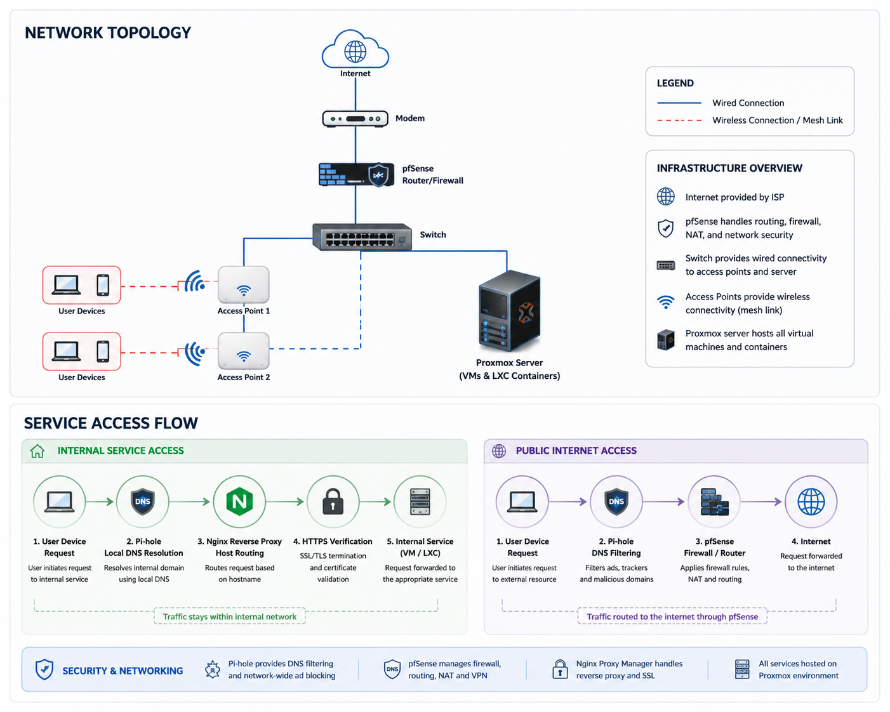

# My Homelab Setup
This repo contains details of my homelab including network diagrams, services, features, and ongoing projects. This is a work in progress and I still have a lot to update and work on. 
## Repository Structure
- diagrams/ - Infrastructure and traffic flow diagrams
- networking/ - DNS routing and network configuration notes
- screenshots/ - Infrastructure dashboards and service screenshots
- projects/ - Individual homelab projects and lab environments
## Core Infrastructure
- Proxmox VE
- pfSense
- Pi-hole
- Nginx Proxy Manager
- Linux VMs and LXC Containers
- Cloudflare-managed Domains
## Features
- Virtualised infrastructure using Proxmox
- DNS filtering and internal hostname resolution
- Reverse proxy routing with HTTPS
- Mesh wireless networking
- Self-hosted applications and services
- Network segmentation and firewall management
## Current Projects
- Virtualised Windows LAN
- Ongoing infrastructure improvements and service deployments
## Network Topology & Service Access Flow

