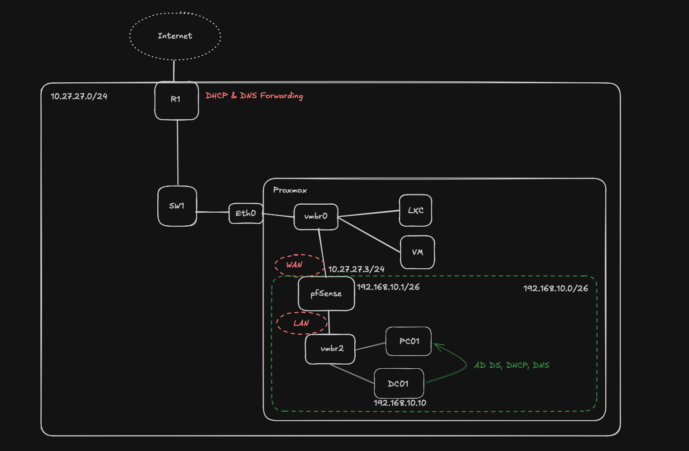

# Enterprise Windows Infrastructure Lab

## Overview

This project documents the process of building a Windows enterprise lab from scratch using Proxmox VE, pfSense, Windows Server and Windows 11.

The aim of the project was to gain practical experience with technologies commonly used in enterprise IT environments, including Active Directory, DNS, DHCP, Windows domain administration and network segmentation. The lab is fully isolated from my home network using a dedicated pfSense firewall, allowing infrastructure and security concepts to be tested without affecting production devices.

The project covers the complete deployment of a small Windows domain, from configuring the virtual network and firewall through to deploying Active Directory, joining Windows clients to the domain, configuring DHCP and DNS, and implementing role-based access control using Active Directory security groups and SMB file shares.

---

## Technologies

* Proxmox VE
* pfSense
* Windows Server 2025
* Windows 11 Pro
* Active Directory Domain Services (AD DS)
* DNS
* DHCP
* SMB File Sharing

---

## Objectives

* Build an isolated enterprise network within Proxmox
* Configure virtual networking and routing using pfSense
* Deploy Windows Server as a Domain Controller
* Configure Active Directory Domain Services
* Implement DNS and DHCP
* Join Windows 11 clients to the domain
* Configure organisational units, users and security groups
* Implement role-based access control using SMB file shares
* Document the deployment and architecture

---

## Network Architecture

The lab is hosted on Proxmox VE and isolated from the home network using a dedicated pfSense virtual firewall.

The pfSense WAN interface connects to the home LAN (10.27.27.0/24), while the LAN interface provides an isolated subnet (192.168.10.0/26). Windows Server acts as the Domain Controller, providing Active Directory, DNS and DHCP services, while a Windows 11 Pro client receives its configuration from the Windows DHCP server and authenticates against the domain.

<p align="center">
  
</p>

### Addressing

| Device                   | Address         |
| ------------------------ | --------------- |
| Home Network             | 10.27.27.0/24   |
| pfSense WAN              | 10.27.27.3      |
| pfSense LAN              | 192.168.10.1/26 |
| Domain Controller (DC01) | 192.168.10.10   |
| Windows 11 Client        | DHCP            |

---

## Active Directory

A new Active Directory forest (`win.lab`) was deployed on the Windows Server Domain Controller.

The environment includes:

* Active Directory Domain Services
* DNS
* DHCP
* Organisational Units
* Domain Users
* Security Groups
* SMB File Shares

Organisational Units:

* Servers
* Workstations
* Users
* Groups

---

## Identity & Access Management

Multiple domain users and security groups were created to simulate a small business environment.

Access to shared folders is managed using Active Directory Security Groups rather than assigning permissions directly to individual users, following the principle of role-based access control (RBAC).

```
User
  ↓
Security Group
  ↓
Shared Resource
```

---

## Services

### Domain Controller

* Active Directory
* DNS
* DHCP
* SMB File Sharing
* User and Group Management

### pfSense

* Routing
* NAT
* Firewall
* Internet gateway for the lab environment

---

## Skills Demonstrated

* Windows Server Administration
* Active Directory
* DNS & DHCP
* Windows Domain Administration
* Group-Based Access Control
* Network Segmentation
* pfSense
* Proxmox Virtualisation
* Enterprise Networking
* Troubleshooting
* Documentation

---

## Walkthrough

This repository is accompanied by a complete video walkthrough covering the architecture, configuration and deployment of the lab from start to finish, including pfSense, Active Directory, DNS, DHCP, domain joining, security groups and file share configuration.


